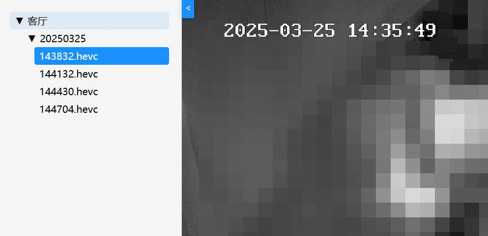

# 联通监控数据抓取

## 源码说明

- [py 源码](back)是妖友的（妖火论坛用户）
- **使用本程序时，应当尊重开源协议，保留作者信息**
- 联通看家：https://we.wo.cn/web/smart-club-pc-v2/?clientId=1001000001
- 妖火论坛：https://yaohuo.me

## 开发计划

- [x] 摄像头录像，~~摄像头录音~~
- [x] 支持多个摄像头和断开重连
- [x] 支持自定义视频存储路径
- [x] 支持设置摄像头视频保留天数
- [x] 支持网页在线查看视频文件

## 使用说明

1. 从 [Releases](https://github.com/zgcwkjOpenProject/GO_UnicomMonitor/releases) 下载 **二进制程序** 和 **config.json** 文件
2. 修改配置文件 **config.json**，具体参考 [妖友源码说明](back)
3. 启动程序

> 配置文件说明

```
host -> 监听端口
user -> 身份验证（用户名:密码）
path -> 存储位置（默认程序目录）
sleep -> 检查间隔时长（单位：秒）
video -> 摄像头配置（数组）
    wsHost -> 消息地址（WebSocket URL）
    paramMsg -> 信息参数（不要“_paramStr_=”字符）
    name -> 摄像头名称
    size -> 截断文件大小（单位：MB）
    count -> 保留天数
```

## 运行效果


